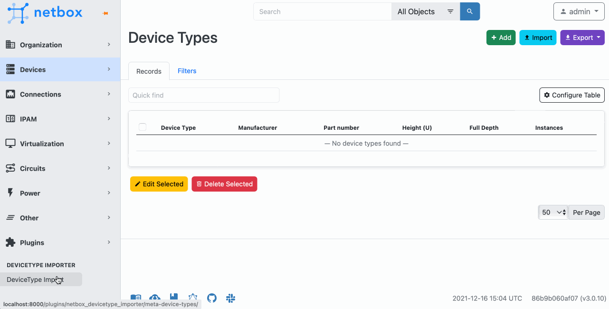

# NetBox Device Type Importer Plugin
[Netbox](https://github.com/netbox-community/netbox) plugin for easy import DeviceType/ModuleType from [NetBox Device Type Library](https://github.com/netbox-community/devicetype-library).

<div align="center">
<a href="https://pypi.org/project/netbox-device-module-type-importer/"></a>
<a href="https://github.com/andy-shady-org/netbox-device-module-type-importer/stargazers"></a>
<a href="https://github.com/andy-shady-org/netbox-device-module-type-importer/network/members"></a>
<a href="https://github.com/andy-shady-org/netbox-device-module-type-importer/issues"></a>
<a href="https://github.com/andy-shady-org/netbox-device-module-type-importer/pulls"></a>
<a href="https://github.com/andy-shady-org/netbox-device-module-type-importer/graphs/contributors"></a>
<a href="https://github.com/andy-shady-org/netbox-device-module-type-importer/blob/master/LICENSE"></a>
<a href="https://github.com/psf/black"></a>
<a href="https://pepy.tech/project/netbox-device-module-type-importer"></a>
<a href="https://pepy.tech/project/netbox-device-module-type-importer"></a>
<a href="https://pepy.tech/project/netbox-device-module-type-importer"></a>
</div>

> [!WARNING]
> 
> Importing Device/Module Type definitions uses Async IO and can take some time (10 to 20 mins) to complete.
> 
> The plugin uses [GitHub GraphQL API](https://docs.github.com/en/graphql) to load DeviceType or ModuleType from [NetBox Device Type Library](https://github.com/netbox-community/devicetype-library).
> 
> The plugin loads only file tree representation from a Github repo and shows it as a table with vendor and model columns.
> 
> DeviceType definitions files are loaded when you try to import selected models.
> 
> So, if you have a lot of models in the repo, it can take a lot of time to load them all.
> 
> Please be patient and don't refresh the page while the plugin is loading data from Github.


## Description

The plugin uses [GitHub GraphQL API](https://docs.github.com/en/graphql) to load DeviceType or ModuleType from [NetBox Device Type Library](https://github.com/netbox-community/devicetype-library). 
The plugin loads only file tree representation from a Github repo and shows it as a table with vendor and model columns. 
DeviceType definitions files are loaded when you try to import selected models.

To use GraphQL API you need to set GitHub personal access token in plugin settings.  You don't need to grant any permissions to the token.    
How to create the token, see ["Creating a personal access token."](https://docs.github.com/en/github/authenticating-to-github/creating-a-personal-access-token)

## Compatibility

| NetBox Version | NetBox Device Type Importer Version |
|----------------|-------------------------------------|
| NetBox 4.5     | \>= 0.0.1                           |

## Installation

The plugin is available as a Python package in pypi and can be installed with pip  

```
pip install netbox-device-module-type-importer
```
Enable the plugin in /opt/netbox/netbox/netbox/configuration.py:
```
PLUGINS = ['netbox_device_module_type_importer',]
```
Restart NetBox and add `netbox-device-module-type-importer` to your local_requirements.txt

Perform database migrations:
```bash
cd /opt/netbox
source venv/bin/activate
python ./netbox/manage.py migrate netbox_device_module_type_importer
```

Full documentation on using plugins with NetBox: [Using Plugins - NetBox Documentation](https://netbox.readthedocs.io/en/stable/plugins/)


## Configuration


Put your GitHub personal access token to [NetBox plugins config](https://netbox.readthedocs.io/en/stable/configuration/optional-settings/#plugins_config)  

### Minimum configuration

```
PLUGINS_CONFIG = {
    'netbox_device_module_type_importer': {
        "github_token": "<YOUR-GITHUB-TOKEN>"
    }
}
```

### Additional configuration
You can configure the plugin to use different GitHub GraphQL API endpoint, batch size, and concurrency settings.
```
PLUGINS_CONFIG = {
    'netbox_device_module_type_importer': {
        "repo_owner": "netbox-community",
        "repo": "devicetype-library",
        "github_url": "https://api.github.com/graphql",
        "batch_size": 50,
        "max_concurrent_requests": 20,
        "max_concurrent_vendors": 20,
    }
}
```

### Benchmarking using AsyncIO versus SyncIO

Note that based on benchmark tests, all connectivity to GitHub is done synchronously. 
The plugin uses AsyncIO to load DeviceType definitions from GitHub in parallel, 
which significantly reduces the time it takes to load all models from the repo.


| Configuration                | Time (s) | Files/s | Speedup |
|------------------------------|----------|---------|---------|
| Synchronous                  | 360.65s  | 14.7    | 1.00×   |
| Async (req=10, vendors=5)    | 88.56s   | 59.9    | 4.07×   |
| Async (req=15, vendors=10)   | 57.71s   | 91.9    | 6.25×   |
| Async (req=20, vendors=20)   | 31.39s   | 169.0   | 11.49×  |


## Contribute

Contributions are always welcome! Please see the [Contribution Guidelines](CONTRIBUTING.md)


## Screenshots

 

## Future 
* Import device images from GitHub repo
* Add support for Gitlab repositories


## Credits

- Thanks to Nikolay Yuzefovich for providing the original version of [DeviceType Importer](https://github.com/nikolay-yuzefovich/netbox-devicetype-importer).

